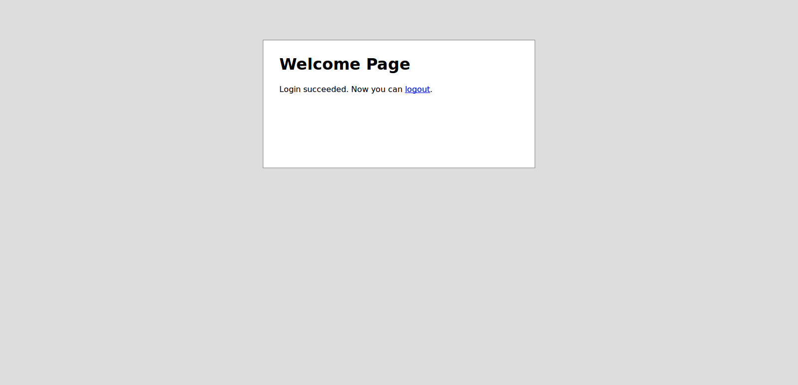

.. robot documentation master file, created by
   sphinx-quickstart on Mon Mar 16 14:22:22 2015.
   You can adapt this file completely to your liking, but it should at least
   contain the root `toctree` directive.

Welcome to robot's documentation!
=================================

Contents:

.. include:: valid_login.rst 

.. toctree::
   :maxdepth: 2

   dms/index.rst
   pm.rst

blabla

*** Mon beau plus beau titre ***

.. note::
  Ma note
  et re-manote

.. seealso::
  Voir aussi ..

.. rubric::
  Titre de la rubrique

.. centered::
  Ceci est un titre centré

.. hlist::
  :columns: 3

  * A list of
  * short items
  * that should be
  * displayed
  * horizontally
  * et encore
  * plus 

.. glossary::

  Environment
    A structure where information about all documents under the root is
    saved, and used for cross-referencing. The environment is pickled
    after the parsing stage, so that successive runs only need to read
    and parse new and changed documents.

  Source directory
  Répertoire source
    The directory which, including its subdirectories, contains all
    source files for one Sphinx project.

#. liste 2
#. isdgsg
#. gsfgsgs

Titre
==============

.. |monremplacement| replace:: MonTexte *Texte*

Sous-Titre
----------
Voici le texte avec des références [#f1]_ et [#f2]_
monremplacement

.. rubric:: Footnotes

.. [#f1] Texte du bas de page 1
.. [#f2] Texte du bas de page 2

.. 
   =====`site imio <http://www.imio.be>`_ 

site  :  `IMIO`_

.. _IMIO: http://www.imio.be/

terme
  explication du terme (1).

Indices and tables
==================

* :ref:`genindex`
* :ref:`modindex`
* :ref:`search`

